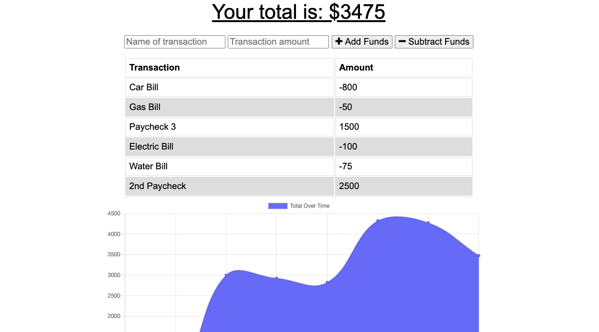
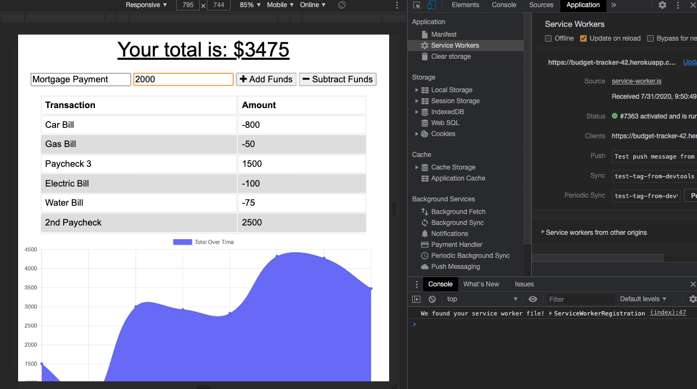
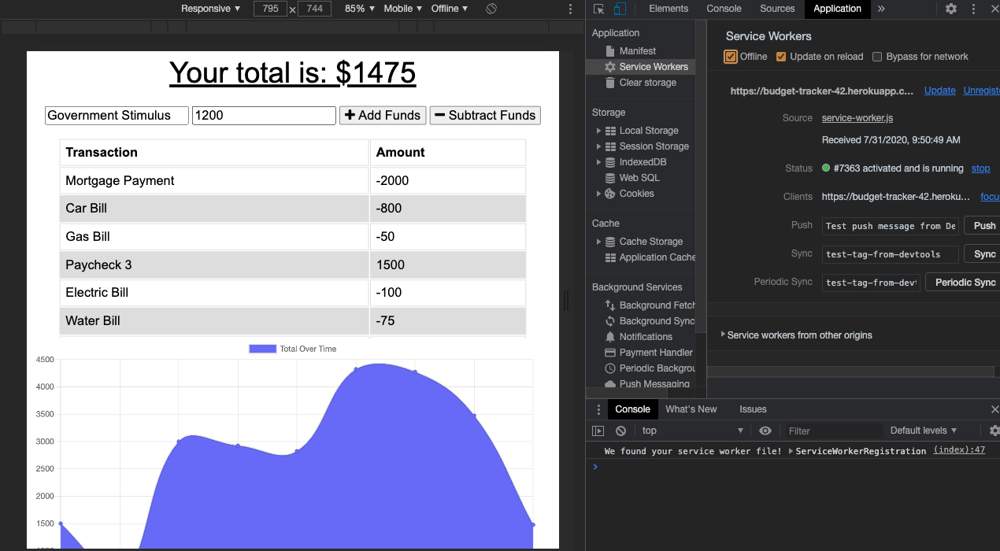
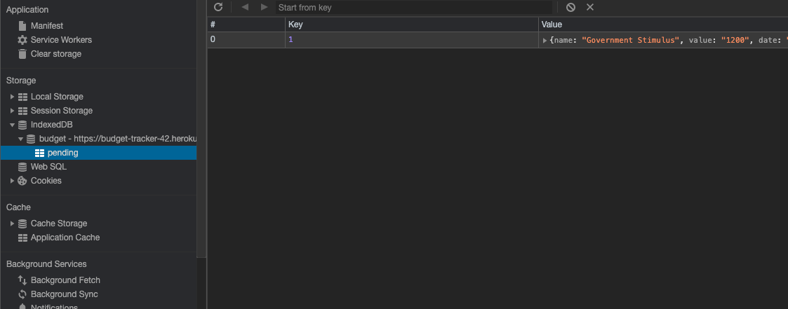
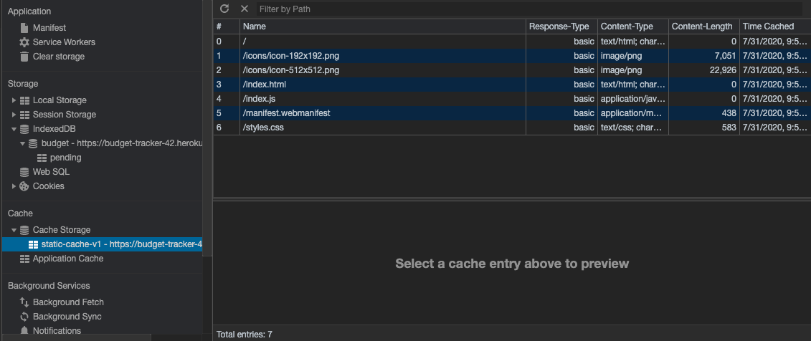
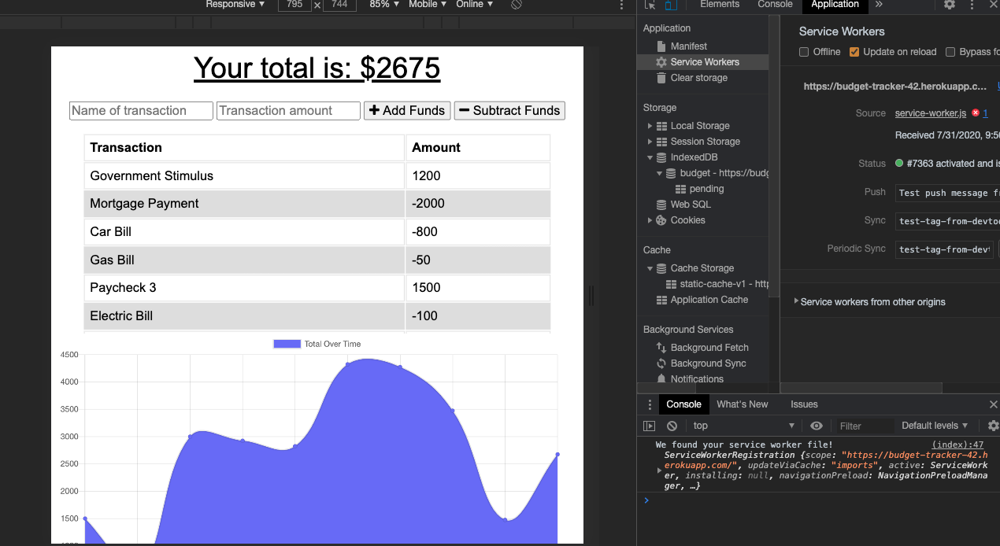

# Budget-Tracker

## About:
In order to make a web based application accessible and usable to as wide an audience as possible, it is important for developers to create offline functionality. This ensures that people with unstable, or inaccessible internet are still able to functionally use the application when their internet connection is dropped. 

The Budget-Tracker App utilizes a combination of technologies to ensure this access. It uses a service-worker, and web-manifest to ensure that images are cached, and information is databased, regardless of an internet connection. Utilizing these tools guarantees that a user will be able to track their deposits and expenses regardless of accessibility.

## Index
1) [About](#About)
1) [Installation](#Installation)
2) [Usage](#Usage)
3) [Contributors](#Contributors)
4) [GitHub](#GitHub)
5) [Screenshots](#screenshots)

## Installation:
Run npm install from the root folder

## Usage:
You can access the site at: https://budget-tracker-42.herokuapp.com/

## Contributors:
Andrew Kleiner

## GitHub Username:
akleiner26

## GitHub Repo:
https://github.com/akleiner26

## GitHub Photo:
 

## GitHub Email:
AndrewJKleiner@gmail.com

## Screenshots

### Launching the App

### Online Transaction

### Offline Transaction

### Saved Offline Data

### Cached Files

### Changes When Back Online

